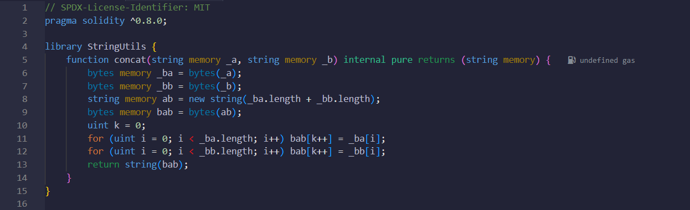
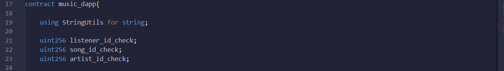
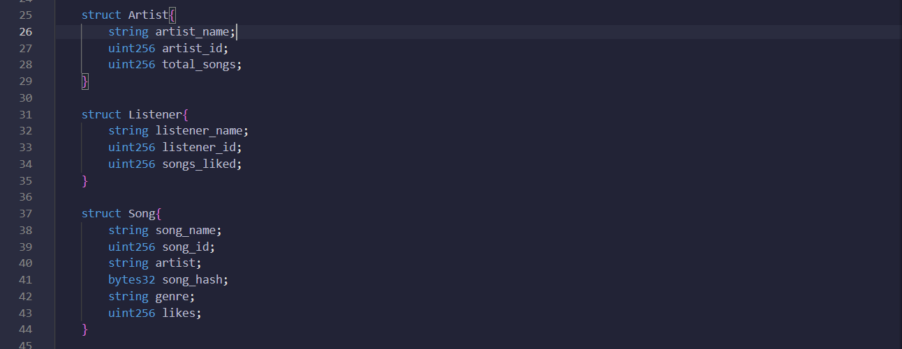
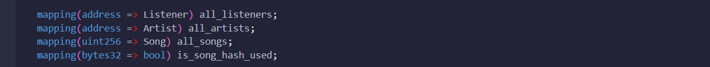
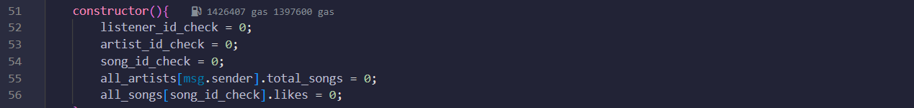
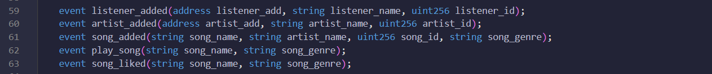
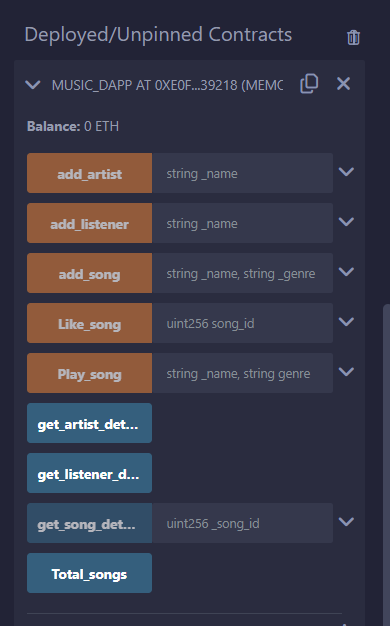

# MUSIC PLAYER DAPP

This smart contract provides the foundation for a decentralized Music DApp built on the Ethereum blockchain. It allows users to register as artists or listeners, manage songs, and interact with music in a transparent and immutable way. The contract facilitates user registration, song upload by artists, song interaction (playing and liking) by listeners, and retrieval of user and song information. All actions are stored securely on the blockchain, ensuring data integrity and preventing manipulation.

## Contract Info

### Library

- **StringUtils** : This library defines a function to concatenate two strings as there is no predefined function in solidity to concatenate two strings. It first converts strings two bytes32 and then adds them and again converts them back to string.

### Global variables 

- **listener_id_check**: this tracks the current listener id, also maintains total listeners. 
- **artist_id_check** : this tracks the current artist id, also maintains total artists.
- **song_id_check**: This is used to track the addition of new song and maintain total number of songs.

### Structs

There are three structs used in the contract - 
- **Artist** : This struct defines all artist variables including artist name, id, total songs published by the artist.
- **Listener** : This struct defines all listener variables such as listeners name, id, songs liked.
- **Song** : This struct defines all song variables including name, artist, id, song hash, genre, song likes.

### Mappings

There are in total 4 mappings in the contract -
- **all_listeners** : this maps the address with the listener struct.
- **all_artists** : this maps the address with the artist struct.
- **all_songs** : this maps the unique song id with the song name.
- **is_song_hash_used** : this maps the song hash with the boolean that checks whether the song hash is used before or not.

### Events

1. **listener_added**: This is triggered when a new listener is added. Includes the listener's address, name, and ID.
2. **artist_added**: Gets triggered when a new artist is added. Includes the artist's address, name, and ID.
3. **song_added**: Triggered when a new song is added. Includes the song's name, artist name, ID, and genre.
4. **play_song**: Triggered when a song is played. Includes the song's name and genre.
5. **song_liked**: Triggered when a song is liked by a listener. Includes the song's name and genre.

### Functions

1. **add_listener(_name: string)**: Adds a new listener to the DApp with the provided name.
2. **add_artist(_name: string)**: Adds a new artist to the DApp with the provided name.
3. **get_artist_details()**: Retrieves details of the artist currently interacting with the DApp.
4. **get_listener_details()**: Retrieves details of the listener currently interacting with the DApp.
5. **add_song(_name: string, _genre: string)**: Allows artists to upload a new song with the provided name and genre.
6. **get_song_details(_song_id: uint256)**: Retrieves details of a specific song based on its ID.
7. **play_song(_name: string, _genre: string)**: Simulates playing a song with the provided name and genre.
8. **like_song(_song_id: uint256)**: Allows listeners to like a song based on its ID.
9. **Total_songs()**: Returns the total number of songs uploaded to the DApp.
