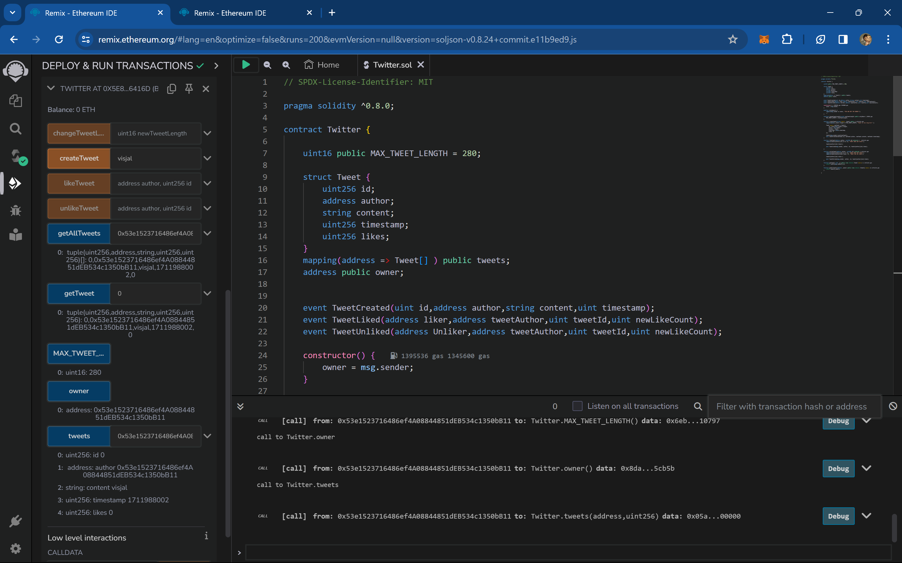

1) Write all the details of your smart contract along with images here, how it will work and tell its overall functionality.
2) A good documentation will grab some extra points for you.

Smart Contract Documentation: Twitter

Overview:
The Twitter smart contract is a decentralized application (DApp) built on the Ethereum blockchain. It provides functionality similar to the popular social media platform Twitter, allowing users to create tweets, like and unlike tweets, and retrieve tweets.

Contract Details:

1]Contract Name: Twitter
2]Version: 1.0.0
3]License: MIT

Contract Structure:

1.State Variables:

1]MAX_TWEET_LENGTH: Defines the maximum length of a tweet.
2]owner: Stores the address of the contract owner.
3]Tweet: Struct defining the structure of a tweet, containing an ID, author address, content,timestamp, and number of likes.
4]tweets: Mapping to store tweets of each user.

2.Events:

1]TweetCreated: Triggered when a new tweet is created.
2]TweetLiked: Triggered when a tweet is liked.
3]TweetUnliked: Triggered when a tweet is unliked.

3.Modifiers:

1]onlyOwner: Restricts access to functions only to the contract owner.

4.Functions:

1]constructor: Initializes the contract owner.
2]changeTweetLength: Allows the contract owner to change the maximum tweet length.
3]createTweet: Allows users to create a new tweet within the maximum length limit.
4]likeTweet: Allows users to like a tweet.
5]unlikeTweet: Allows users to unlike a tweet.
6]getTweet: Retrieves a specific tweet by index for the caller.
7]getAllTweets: Retrieves all tweets of a specified user.

How it Works:

1]Users interact with the Twitter contract by calling its functions.
2]To create a tweet, a user invokes the createTweet function, providing the tweet content within the character limit.
3]Users can like or unlike a tweet by calling the likeTweet or unlikeTweet function, respectively.
4]Tweets can be retrieved using the getTweet function for individual tweets or the getAllTweets function to fetch all tweets of a specific user.

Overall Functionality:

1]Allows users to create tweets.
2]Limits tweet length.
3]Enables users to like and unlike tweets.
4]Provides functions to retrieve tweets.
5]Ownership functionality allows the contract owner to modify the maximum tweet length.

